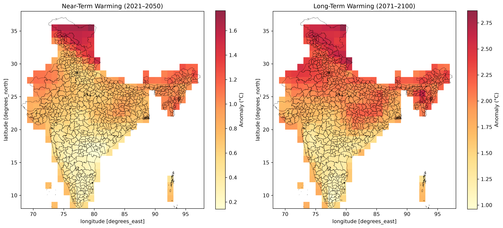

# India Climate Warming Assessment using CMIP6 & SSP2-4.5

Physical climate risk analysis projecting mid-century warming across India using CMIP6 projections, benchmarked against a 1981–2010 historical baseline.

## Overview

This project quantifies how much India's districts are projected to warm by mid-century (2041–2070) under a moderate-emissions pathway (SSP2-4.5), relative to their own 1981–2010 historical baseline — not a single national average. The output is a district-level warming map built from CMIP6 model output.

- **Model:** MRI-ESM2-0
- **Scenario:** SSP2-4.5 (`ssp245`)
- **Variable:** `tas` (near-surface air temperature), monthly
- **Baseline period:** 1981–2010
- **Future period:** 2041–2070
- **Region:** India (6°N–37°N, 68°E–98°E), with district boundaries overlaid

## Repo structure

```
india-climate-risk-assessment/
│
├── data/                  # CMIP6 NetCDF files (not tracked in git — see Setup below)
├── notebooks/
│   └── analysis.ipynb     # Full pipeline: load → convert units → anomaly → map
├── outputs/
│   └── india_warming_projection.png
└── README.md
```

## Methodology

1. **Load** historical (1850–2014) and SSP2-4.5 (2015–2100) `tas` NetCDF files for MRI-ESM2-0 and concatenate into a single continuous time series.
2. **Convert units** from Kelvin to Celsius and crop to the India bounding box.
3. **Compute per-pixel climatologies** for both the 1981–2010 baseline and the 2041–2070 future period, keeping the `lat`/`lon` grid intact throughout (rather than collapsing to a national average before differencing) — this ensures each grid cell is compared against its own local baseline, not the country-wide mean.
4. **Take the anomaly** (future − own local baseline) per pixel, then average across years to get a single warming map.
5. **Plot** the anomaly with district boundaries overlaid, annotated with the baseline/future periods, units, and the India-wide mean warming for quick reference.

## Setup

### 1. Environment

```bash
pip install xarray rioxarray geopandas matplotlib netcdf4
```

### 2. Data

#### CMIP6 Climate Data

Download the following CMIP6 `tas` (monthly, `Amon`) files for **MRI-ESM2-0**, variant `r1i1p1f1`, grid `gn`, from an [ESGF](https://esgf-node.llnl.gov/search/cmip6/) node, and place them in `data/`:

| Experiment | File pattern |
|---|---|
| Historical | `tas_Amon_MRI-ESM2-0_historical_r1i1p1f1_gn_185001-201412.nc` |
| SSP2-4.5 | `tas_Amon_MRI-ESM2-0_ssp245_r1i1p1f1_gn_201501-210012.nc` |

The NetCDF (`.nc`) climate data files are not included in this repository due to their large file size.

#### District Boundaries

The India district boundary GeoJSON used in this project is sourced from
[HariKumarValluru/India-Map-with-States-and-Districts-GeoJson](https://github.com/HariKumarValluru/India-Map-with-States-and-Districts-GeoJson).


### 3. Run

```bash
jupyter notebook notebooks/analysis.ipynb
```

Run all cells top to bottom. The final figure is saved to `outputs/india_warming_districts.png`.

## Output



District-level projected warming (°C) for 2041–2070 under SSP2-4.5, relative to each district's own 1981–2010 baseline.

## Notes / limitations

- Single-model (MRI-ESM2-0) analysis — no multi-model ensemble, so results reflect one model's climate sensitivity rather than an inter-model spread.
- SSP2-4.5 only; SSP5-8.5 or other scenarios would show a wider warming range.
- Anomalies are computed per grid cell, not per district polygon — district boundaries are an overlay for readability, not a zonal statistic.
